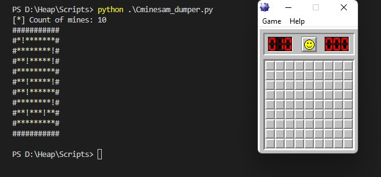
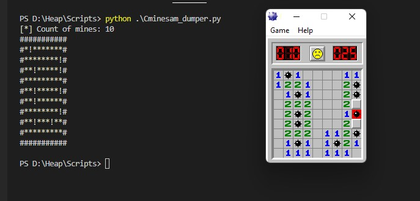
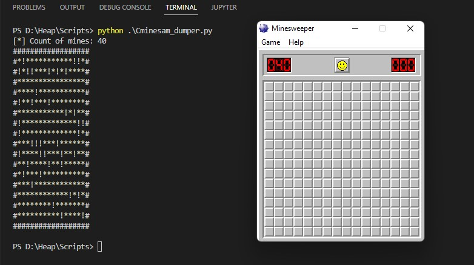
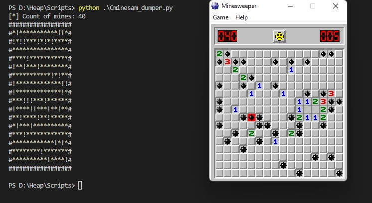
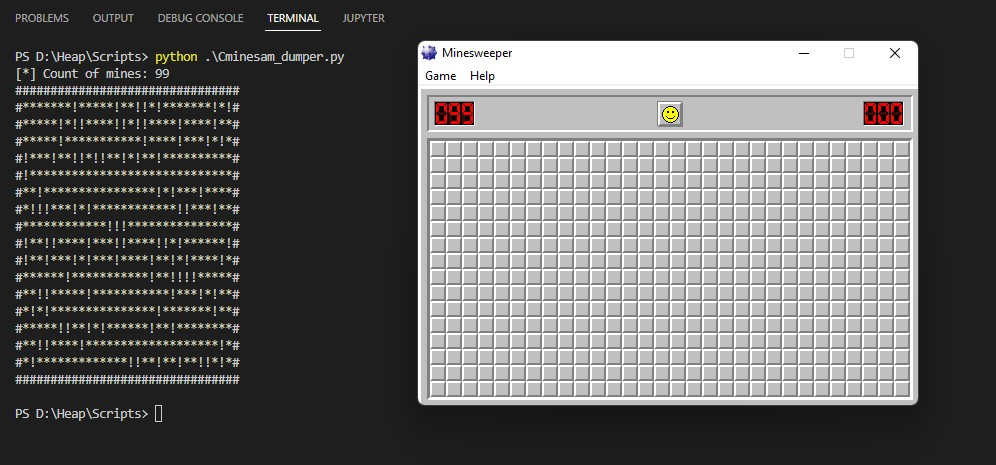
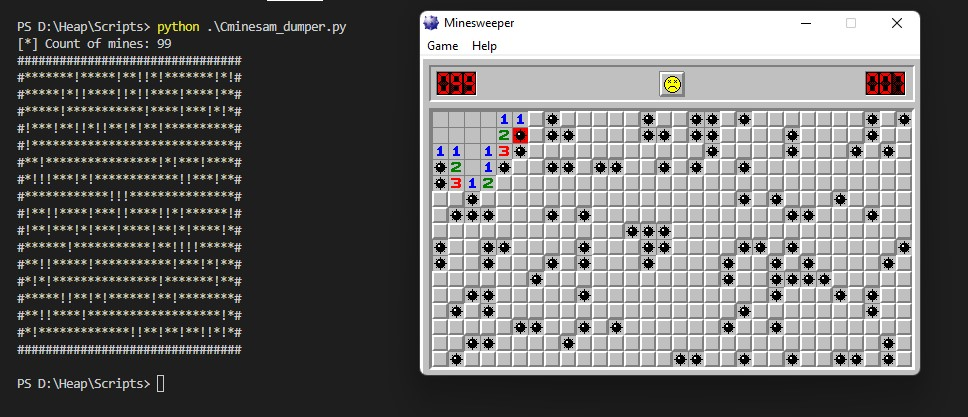
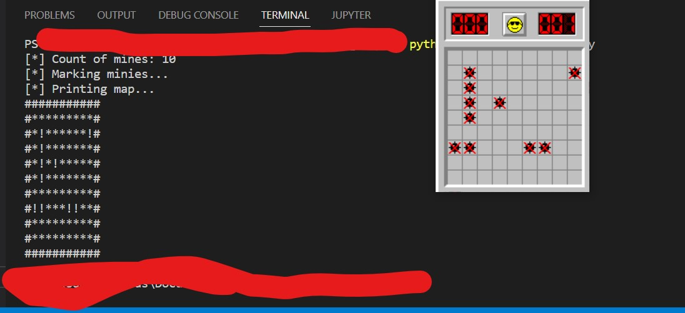
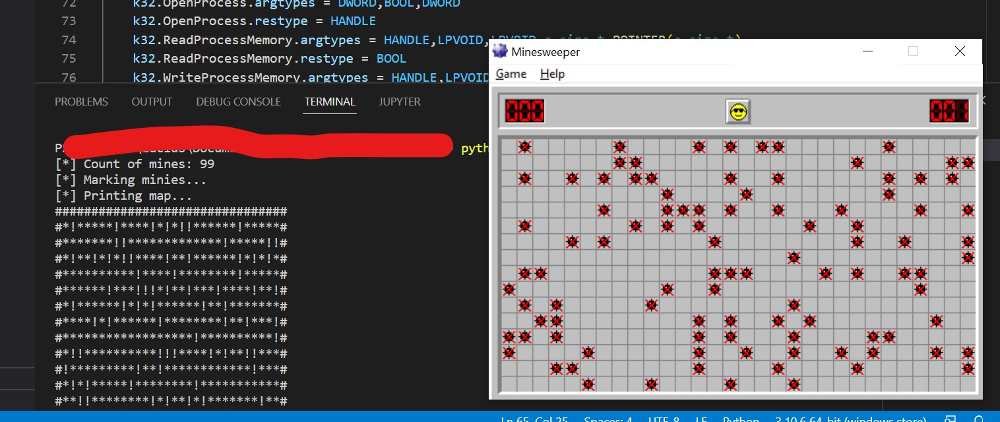
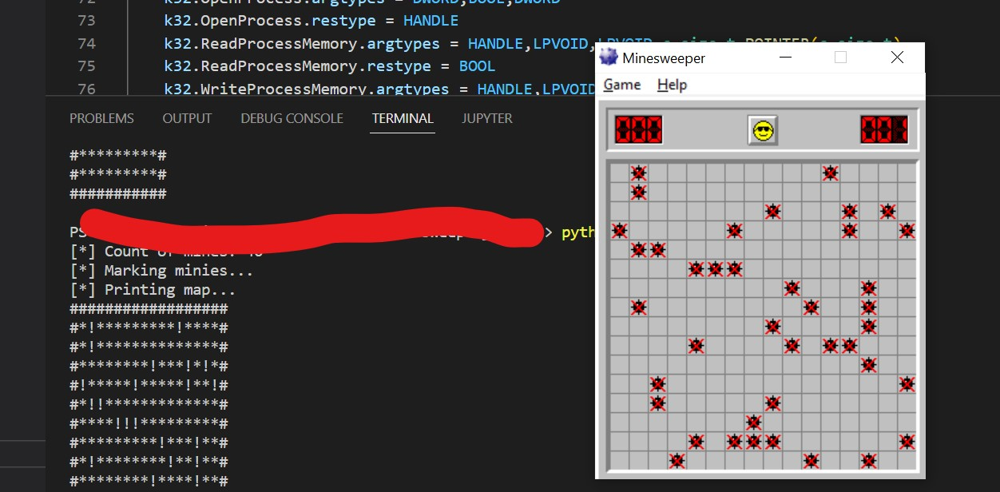

# minesweeper_dumper
Simple python script to attach to classic minesweeper process and dumping memory with placed bombs.

Getting count of mines and creating the map in dependence on the count.

### Demo

Beginner:

Intermediate:

Expert:

## Added function to mark minies
Default work = autosolver

